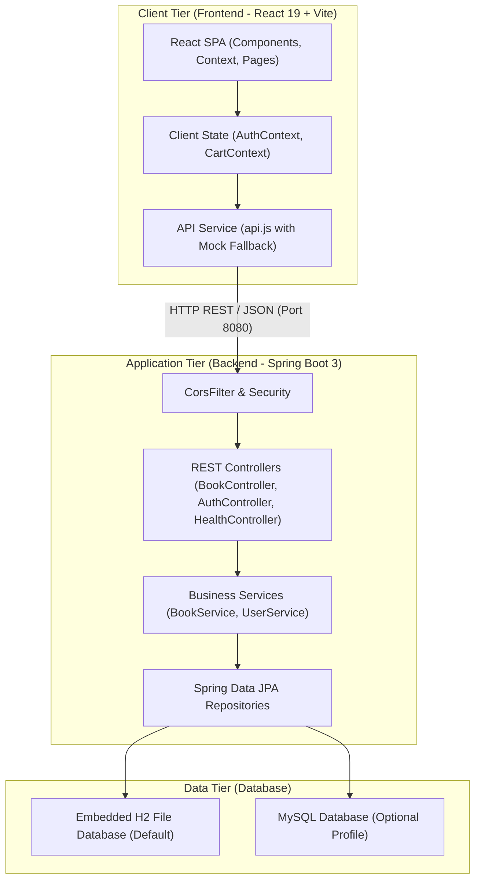
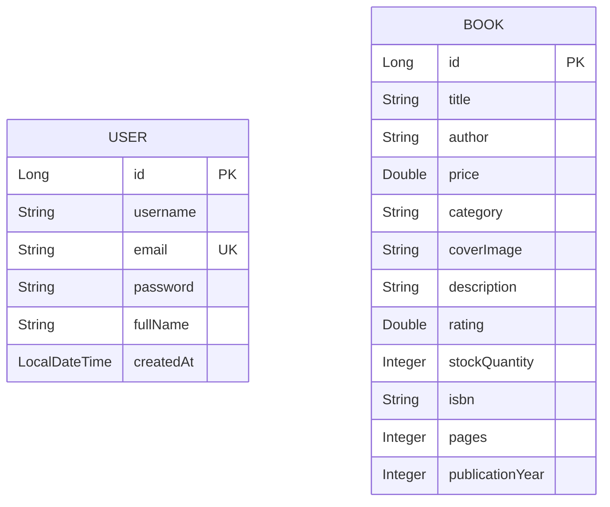

# 📜 Software Requirements Specification (SRS)
## Online Bookstore Full-Stack Application

**Document Version:** 1.0.0  
**Date:** September 15, 2026  
**Status:** Approved Specification  

---

## 1. Introduction

### 1.1 Purpose
This Software Requirements Specification (SRS) document details the complete functional, non-functional, data, and system requirements for the **Online Bookstore** full-stack web application. It serves as the primary reference manual for developers, system architects, software testers, and project stakeholders.

### 1.2 Scope
The Online Bookstore system is an e-commerce platform allowing users to discover, search, filter, preview, and purchase books online. The system incorporates a modern **React 19 + Vite** single-page application (SPA) client and a robust **Spring Boot 3 + Java 17** RESTful API backend, supported by an **H2 / MySQL** database tier.

### 1.3 Definitions, Acronyms, and Abbreviations
- **SRS**: Software Requirements Specification
- **SPA**: Single Page Application
- **JWT**: JSON Web Token
- **BCrypt**: Adaptive cryptographic hash function for password hashing
- **DTO**: Data Transfer Object
- **JPA**: Java Persistence API (Hibernate implementation)
- **H2**: Embedded, zero-configuration Java SQL database
- **CORS**: Cross-Origin Resource Sharing

---

## 2. System Architecture & High-Level Overview

The system follows a standard three-tier decoupled client-server architecture:

---

## 3. User Personas & Roles

| Role | Description | Access Level |
| :--- | :--- | :--- |
| **Guest Visitor** | Unauthenticated user browsing the store. | Can search books, filter categories, view book details, add items to cart, and attempt checkout. |
| **Registered Customer** | Authenticated user with an account. | Full guest capabilities + persistent account profile, seamless login, and personalized shopping experience. |
| **System Administrator** | Technical user / Inventory Manager. | Full customer access + REST API access to add, update, or remove book records from the system catalogue. |

---

## 4. Functional Requirements (FR)

### FR-1: User Management & Authentication

- **FR-1.1: User Account Registration**
  - **Description**: Users must be able to register a new account by providing Full Name, Email Address, and Password.
  - **Validation**: Email must follow standard RFC 5322 format and be unique across the system. Password must be at least 6 characters long.
  - **Security**: Passwords must be hashed using BCrypt before persisting in the database.

- **FR-1.2: User Authentication (Login)**
  - **Description**: Registered users must be able to log in using their email and password credentials.
  - **Behavior**: On successful authentication, the system returns a success payload with user details and persists the user session in client storage.
  - **Failure Handling**: System returns an HTTP `401 Unauthorized` status with an error message for invalid credentials.

- **FR-1.3: User Session Persistence**
  - **Description**: Authenticated user session state must persist across page refreshes using browser local storage.

---

### FR-2: Book Catalog & Discovery

- **FR-2.1: Catalog Retrieval**
  - **Description**: The system shall display all available books in a responsive card grid with cover images, titles, authors, prices, ratings, and stock status.

- **FR-2.2: Category Filtering**
  - **Description**: Users can filter books by category (e.g., *Fiction*, *Non-Fiction*, *Technology*, *Sci-Fi*, *Biography*, *Self-Help*). Selecting "All Categories" resets the filter.

- **FR-2.3: Full-Text Search**
  - **Description**: The system must support instant, case-insensitive keyword search across book titles, author names, and descriptions.

- **FR-2.4: Catalog Sorting**
  - **Description**: Users can sort the book listing dynamically by:
    - Price: Low to High
    - Price: High to Low
    - Customer Rating: High to Low
    - Publication Year: Newest First

- **FR-2.5: Featured Books Spotlight**
  - **Description**: The system must provide an endpoint (`/api/books/featured`) and UI section highlighting top-rated or spotlighted books on the Home page.

- **FR-2.6: Book Detail Modal**
  - **Description**: Clicking any book card opens a detailed modal displaying expanded synopsis, ISBN, publication date, pages, categories, star ratings, stock availability, and an "Add to Cart" button.

---

### FR-3: Shopping Cart & Checkout Process

- **FR-3.1: Add / Remove Cart Items**
  - **Description**: Users can add books to the cart from the grid or detail modal. Users can remove individual items or clear the entire cart.

- **FR-3.2: Cart Quantity Adjustment**
  - **Description**: Users can increment or decrement quantity per book in the cart drawer. Quantities cannot exceed available inventory stock.

- **FR-3.3: Cart State Persistence**
  - **Description**: The cart contents must automatically sync to browser local storage so user items are preserved if the page reloads.

- **FR-3.4: Order Summary Calculation**
  - **Description**: The cart must calculate Subtotal, Estimated Tax (e.g. 8%), Shipping Fee (or Free Shipping over $50 threshold), and Grand Total in real-time.

- **FR-3.5: Simulated Checkout Workflow**
  - **Description**: Completing checkout validates cart items, displays a success notification, clears the active cart, and resets cart state.

---

### FR-4: Inventory & Data Management

- **FR-4.1: Book Creation API**
  - **Description**: Administrators can add a new book record to the catalog via `POST /api/books` with valid parameters (title, author, price, category, stock, cover image URL).

- **FR-4.2: Book Deletion API**
  - **Description**: Administrators can delete a book record by ID via `DELETE /api/books/{id}`.

- **FR-4.3: Automatic Seed Data**
  - **Description**: Upon application startup, if the database repository contains 0 records, the backend must seed sample books automatically.

---

### FR-5: Health Diagnostics

- **FR-5.1: System Health Endpoint**
  - **Description**: The backend must expose a `GET /api/health` endpoint returning system operational status (`UP`), timestamp, service identifier, and version information.

---

## 5. Non-Functional Requirements (NFR)

### NFR-1: Performance & Scalability
- **API Latency**: Backend REST endpoints must respond within **< 200 ms** under normal load (100 concurrent requests).
- **Client Rendering**: UI initial page load time must remain **< 1.5 seconds**, and catalog filters must update in **< 50 ms**.
- **Bundle Optimization**: Frontend assets must be bundled and minified using Vite, utilizing tree-shaking for minimal JS bundle footprint.

### NFR-2: Security & Privacy
- **Password Protection**: Passwords must never be stored in plain text. BCrypt with default strength (10 rounds) must be used.
- **SQL Injection Prevention**: All database queries must use JPA parameterized queries / Spring Data Repositories to eliminate SQL injection vulnerabilities.
- **XSS Prevention**: React DOM auto-escaping must be leveraged to prevent Cross-Site Scripting (XSS).
- **CORS Configuration**: CORS policies must explicitly allow incoming requests from authorized frontend origins (`http://localhost:5173`).

### NFR-3: Reliability & High Availability
- **Client Fallback Mode**: If the Spring Boot backend server is down or unreachable, the frontend API layer must seamlessly fall back to local mock data without crashing the UI, ensuring 100% demo availability.
- **Database Durability**: Data written to H2 embedded database file (`./data/bookstoredb`) must persist reliably across application restarts.

### NFR-4: Usability & Aesthetic Design
- **UI Design System**: The interface must adhere to modern dark mode standards featuring glassmorphism elements, custom CSS variables/tokens, harmonious typography (Inter/Outfit), smooth CSS transitions, and subtle hover visual feedback.
- **Responsiveness**: The web app layout must adapt fluidly across mobile (< 640px), tablet (640px - 1024px), and desktop (> 1024px) viewports.

### NFR-5: Maintainability & Code Quality
- **Layered Architecture**: Backend code must strictly maintain separation between Controllers, Services, Repositories, DTOs, and Entities.
- **Component Modularization**: Frontend React components must remain modular, clean, and typed/documented.

---

## 6. Data Dictionary & Entity Relationship

### 6.1 Entity Attributes Table

#### `User` Entity (`users` table)
| Field Name | Type | Constraints | Description |
| :--- | :--- | :--- | :--- |
| `id` | `Long` | Primary Key, Auto Increment | Unique user ID |
| `username` | `String` | Not Null, Length(3..50) | Unique username handle |
| `email` | `String` | Not Null, Unique, Email Format | Account login email |
| `password` | `String` | Not Null | BCrypt hashed password |
| `fullName` | `String` | Not Null | User's display name |
| `createdAt` | `LocalDateTime` | Auto-populated | Registration timestamp |

#### `Book` Entity (`books` table)
| Field Name | Type | Constraints | Description |
| :--- | :--- | :--- | :--- |
| `id` | `Long` | Primary Key, Auto Increment | Unique book ID |
| `title` | `String` | Not Null | Book title |
| `author` | `String` | Not Null | Author full name |
| `price` | `Double` | Not Null, Min(0.0) | Selling price in USD |
| `category` | `String` | Not Null | Category classification |
| `coverImage` | `String` | Length(1000) | Image URL |
| `description` | `String` | Length(2000) | Detailed book synopsis |
| `rating` | `Double` | Min(0.0), Max(5.0) | Customer rating average |
| `stockQuantity`| `Integer` | Min(0) | Available unit inventory |
| `isbn` | `String` | Length(20) | International Standard Book Number |
| `pages` | `Integer` | Min(1) | Page count |
| `publicationYear`| `Integer` | Positive Integer | Year published |

---

## 7. System Prerequisites & Hardware Specifications

### 7.1 Software Dependencies
- **JDK**: Java Development Kit 17 or higher
- **Build Tool**: Apache Maven 3.8+
- **Runtime Environment**: Node.js 18.0+ and npm 9.0+
- **Web Browser**: Google Chrome, Mozilla Firefox, Apple Safari, or Microsoft Edge (modern versions supporting ES6+)

### 7.2 Minimum Hardware Requirements
- **Processor**: Dual-Core CPU @ 2.0 GHz or higher
- **RAM**: 4 GB RAM minimum (8 GB recommended for concurrent IDE + backend + frontend execution)
- **Disk Space**: 500 MB free space for code, dependencies, and H2 database storage
